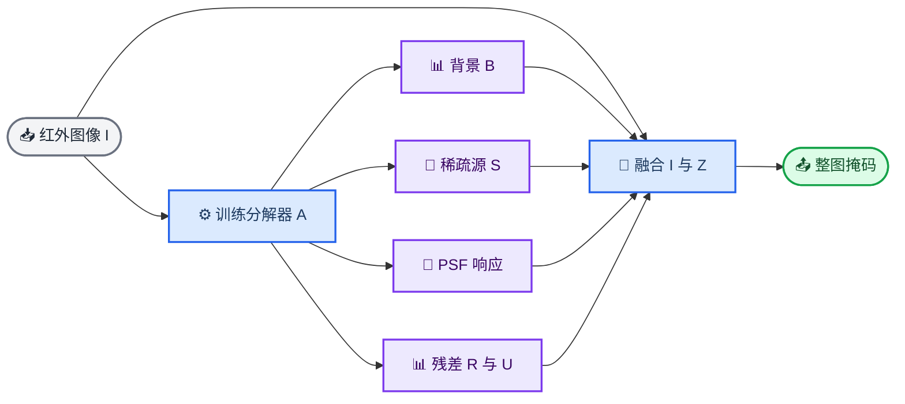
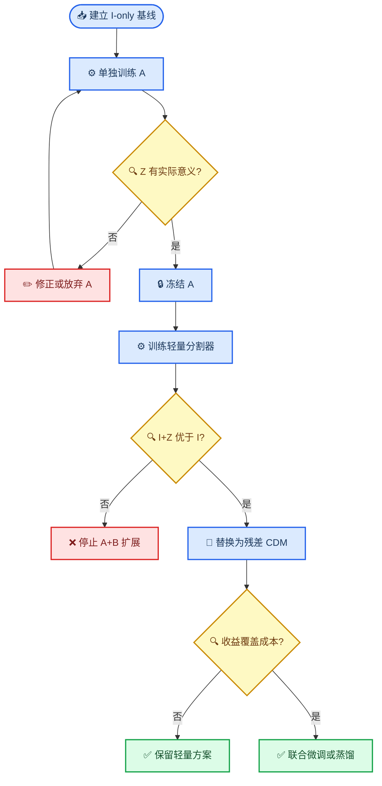

# 红外小目标分割研究方向决策记录

_探索阶段总结与可审查决策链，更新于 2026-09-02_

---

| 字段 | 当前状态 |
| --- | --- |
| **任务** | 单帧红外小目标整图分割 |
| **研究阶段** | 假设形成与最小验证 |
| **方向 A** | 背景感知的稀疏 PSF 解混 |
| **方向 B** | 条件残差扩散掩膜生成 |
| **当前决定** | 先独立验证 A，再决定是否引入 B |
| **本文性质** | 研究讨论与阶段性决策记录，不是最终模型说明书 |

> 📌 **说明：** 本文不记录不可复核的逐字内部思维活动，而是完整记录研究问题、关键假设、反驳、证据、备选方案、风险和决策理由，以便后续实验推翻或修订。

## 🎯 任务定义与研究边界

### 输入与输出

必须区分训练与推理，否则“输入图片＋整图掩码，输出整图掩码”会形成标签泄漏。

- **训练输入：** 单帧红外图像 `I`，整图二值掩码 `Y` 只作为监督信号
- **推理输入：** 单帧红外图像 `I`
- **模型输出：** 与原图同尺寸的目标概率图 `P` 或二值掩码 `Y_hat`
- **任务语义：** 红外小目标分割，而不是只输出目标中心点或检测框

形式化表达为：

$$
f_\theta: I \mapsto P(Y\mid I), \qquad
\hat{Y}=\mathbb{1}[P(Y\mid I)>\tau].
$$

如果真实掩码 `Y` 在推理时也被输入，那么模型已经获得答案，任务将不再是有意义的分割学习。后文凡提到“使用掩码”，均指训练监督或训练期先验构造，不指部署时输入。

### 评价目标

该任务不应只追求像素重叠率。小目标只占极少像素，单个目标的漏检或一个高亮杂波的误报，可能只改变很少像素，却具有显著的目标级后果。近期工作已经明确指出，IRSTD 中像素级与目标级指标彼此割裂、错误类型分析不足以及跨数据集评估薄弱的问题。[^1]

因此后续实验至少同时报告：

- **像素级：** `IoU`、`nIoU` 或 Dice
- **目标级：** 检测概率 `Pd`、虚警率 `Fa`，并明确连通域匹配规则
- **效率：** 参数量、FLOPs、峰值显存、单图延迟和吞吐率
- **稳健性：** 跨数据集、低信杂比、强杂波、不同目标尺度与不同点扩散形态
- **错误结构：** 漏检、孤立虚警、目标粘连、边界膨胀和晕环

## 🔍 当前任务最核心的痛点

### 痛点一：观测不可辨识，而不只是特征不够强

红外小目标通常缺少纹理、形状和稳定边界；目标与高亮云边、建筑灯点、传感器坏点或局部噪声可能在一个小邻域内十分相似。由单帧图像判断某个亮点是目标还是背景，本质上存在不可辨识性。更大的网络无法凭空创造图像中不存在的信息，只能利用数据分布形成更强先验。

### 痛点二：下采样与效率要求会直接破坏目标

目标可能只有几个像素。平均池化会稀释能量，最大池化虽然保留峰值，却也会保留高亮杂波；多次下采样甚至会使目标完全消失。与此同时，全局高分辨率自注意力又会造成明显的计算和显存负担。

因此，若只能在“不断池化”和“局部计算”之间选择，**局部高分辨率建模更适合作为主干**。合理策略不是二选一，而是：

- 保留高分辨率浅层或局部分支
- 仅对低频背景和全局语境做低成本压缩
- 用移位窗口、跨窗口桥接或线性复杂度模块传递全局信息
- 避免把重复 `mean pooling` 或 `max pooling` 当作主要效率机制

Swin Transformer 说明局部窗口可将注意力复杂度控制为随图像尺寸线性增长，并通过移位窗口建立跨窗口联系；MiM-ISTD 则在高分辨率 IRSTD 上探索了局部—全局线性复杂度建模。[^2][^3]

### 痛点三：极端类别不平衡与目标级不敏感

背景像素远多于目标像素。网络可以通过预测大面积背景获得较低损失，而弱目标的梯度容易被淹没。普通 BCE、Dice 或像素 IoU 也不必然与目标级召回和虚警一致。IRSTD-Diff 将这一问题概括为目标级不敏感，并尝试显式建模掩码后验。[^4]

### 痛点四：背景杂波与目标先验高度重叠

“亮、小、局部凸起、近似高斯”并不是目标独有属性。云边、海浪、地物反射、固定图样噪声和坏点同样可能满足这些低层先验。只强化局部显著性，往往会同步放大难负样本。

### 痛点五：数据集偏差与跨域泛化

不同数据集的传感器、分辨率、噪声、场景和标注规则不同。模型可能学会数据集特有的背景纹理或预处理痕迹，而不是稳定的目标判别规律。仅在一个数据集随机切分上提高 IoU，不能充分证明方法有效。[^1]

## 📚 对当前模型与多模态设想的判断

### 当前模型最核心的意义

当前模型的价值不在于它已经是最终架构，而在于它验证了一条可微流程：

```text
整图粗定位 → 可微裁剪 → 局部高分辨率分割 → 回贴整图
```

这条流程把有限计算集中到疑似区域，并尝试避免目标在整图深层下采样中消失。它应被视为**实验载体和效率基线**，而不是必须保留的最终形式。由于训练已经使用整图掩码，它也不应被描述为纯点监督方法。

### Kimi K3 式图文嵌入能否迁移

可以迁移“把视觉表征转成 token 并与语言 token 共同建模”的思想，但必须纠正表述：它不是把图片变成自然语言词语，而是将图像切分或编码为视觉 token，再投影到语言模型可处理的表示空间。Kimi-VL 的 MoonViT 使用图像 patch、序列打包和投影器完成视觉—语言对齐；Kimi K3 延续了原生多模态路线。[^5][^6]

对 IRSTD 而言，语言最可能提供的是：

- 场景和背景类型先验
- 传感器或域信息
- 对云层、海面、城市灯点等难背景的语义描述
- 训练期教师信号或跨域对齐

语言不能恢复原图中已经丢失的微弱像素证据，也不能天然给出精确边界。已有 SAIST 和 MIRSAM 已将视觉—语言先验或 Segment Anything 范式用于红外小目标分割，因此“引入图文 token”本身不再足以构成创新。[^7][^8]

### 使用 ViT 后如何保持效率

不应默认在推理端部署完整视觉语言模型。优先顺序应是：

1. 将大模型作为训练期教师，部署轻量学生
2. 对低分辨率全局语境使用轻量 token，对候选区域保留高分辨率特征
3. 使用局部窗口、稀疏 token 或线性复杂度序列模块
4. 仅在不确定区域调用昂贵模块
5. 通过蒸馏、剪枝、量化或单步近似削减部署成本

结论是：**语言或 ViT 是可选的先验来源，不是当前最优先的主线。** 现阶段先解决物理先验是否真正增益分割，再讨论多模态扩展。

## ⚙️ 方向 A：背景感知的稀疏 PSF 解混

### 原始设想与必要纠错

原始设想是“红外目标的热力分布符合高斯分布，高斯具有可加性，因此把整幅图分解成多个高斯分布，再进行注意力或分割”。其中有三处必须直接纠正：

1. **更准确的是成像后的未分辨点目标响应常可近似为 PSF，且 PSF 在某些条件下近似二维高斯**，而不是目标真实热力分布必然服从高斯
2. 实际目标受光学系统、离焦、运动拖影、采样、饱和和目标扩展影响，可能明显偏离高斯；已有研究明确把二维高斯视作近似，而非普遍真理[^9]
3. 高斯函数可线性叠加，不代表从一幅图中分解出的成分唯一；背景纹理、噪声和多个重叠源可产生相似观测

所以，“整图由若干高斯组成”过强且容易产生伪分解。更稳妥的模型是把目标分为**PSF 可解释部分与非 PSF 残差部分**。

### 建议的生成模型

$$
I = B + H_{\phi}(S) + R + N,
$$

其中：

- `B`：空间变化的背景
- `S`：非负稀疏点源或中心强度图
- `H_phi`：由参数 `phi` 控制的空间变化 PSF 算子
- `R`：不能由 PSF 解释的目标残差，例如扩展、非对称或拖影结构
- `N`：随机噪声和未建模扰动

进一步可加入适用性门控：

$$
O = \alpha\,H_{\phi}(S) + (1-\alpha)R,
\qquad \alpha\in[0,1].
$$

这使模型可以对点状目标使用 PSF 解释，对不符合假设的目标退回数据驱动残差，而不是强迫所有目标高斯化。

### A 的输出与分割接口

A 不直接等同于最终分割器。它输出条件集合：

$$
Z=\{B,S,T_{\mathrm{psf}},R,U\},
$$

其中 `T_psf=H_phi(S)`，`U` 表示拟合误差、参数置信度或不确定性。后续分割器必须同时接收原始图像：

$$
\hat{Y}=g_\psi(I,Z).
$$

保留 `I` 的原因是 A 可能漏掉弱目标或错误解释难负样本；如果 B 只看 `Z`，A 的信息损失将不可逆地传递下去。



### 别人已经完成的部分

| 已有路线 | 已完成内容 | 对本方向的约束 |
| --- | --- | --- |
| **经典 PSF/匹配滤波** | 用高斯或实测 PSF 表示点目标 | “目标近似高斯”不是新意[^9] |
| **RPCANet** | 展开低秩背景、稀疏目标和重建 | 背景—稀疏目标分解已有强基线[^10] |
| **DRPCA-Net** | 用输入条件化参数适应不同背景 | 动态展开与背景适配也已有工作[^11] |
| **RPCANet++** | 背景估计、稀疏对象、图像恢复和整图稀疏对象分割 | “分解后分割”已有直接近邻[^12] |
| **DISTA-Net** | 二维高斯 PSF、稀疏亚像素点源和近邻目标解混 | PSF 稀疏解混已有高水平工作[^13] |
| **Gaussian-prior convolution** | 在特征提取中加入可学习高斯形卷积 | “高斯卷积＋网络”也已拥挤[^14] |

DISTA-Net 的目标主要是近邻点源的数量、亚像素位置和强度恢复，而不是复杂真实背景下的整图语义掩码；这留下了任务差异，但不能忽视方法上的高度邻近。[^13]

### 仍可能构成研究贡献的部分

单纯把 RPCANet++ 与 DISTA-Net 拼接，难以形成足够清晰的贡献。更有研究价值的差异点可能是：

- 将对象显式分成 `H_phi(S)+R`，不强迫所有目标服从高斯
- 设计空间变化、尺度变化或非对称 PSF，而不是固定核
- 用 `U` 和拟合残差判断 PSF 先验何时可信
- 以背景上下文抑制“同样像高斯点”的杂波
- 用真实整图掩码联合约束可解释分量，但不需要中间变量真值
- 在跨传感器和跨数据集上验证 PSF 先验是否仍有效

### 最大风险

1. **非唯一分解：** `B`、`H_phi(S)` 与 `R` 可互相吞噬能量
2. **监督不足：** 数据通常只有掩码，没有真实背景、PSF、中心强度或噪声标签
3. **语义错配：** A 优化的是解释或重建图像，最终任务优化的是目标语义；高亮杂波可能被 A 很好地解释成点源
4. **假设失效：** 扩展目标、饱和目标、运动目标和非理想光学响应可能不符合 PSF 模型
5. **创新边界：** 审稿人可能将其视为 RPCANet++ 与 DISTA-Net 的组合
6. **效率负担：** 迭代展开、动态核和多分支融合可能抵消原本的轻量化目标

### 对二区潜力的客观判断

**这个想法本身不足以保证二区。** 如果只是增加一个高斯分解分支或高斯注意力，创新性偏弱；如果能够给出明确的生成模型、退化防护、PSF 失配处理、难负样本抑制，并在真实场景和跨域实验中稳定降低目标级虚警，那么它具备二区论文的潜力。决定论文等级的是被证伪后仍成立的实验证据，而不是模块数量。

## 🔄 方向 B：条件扩散掩膜生成

### 理论可行性

无条件扩散模型只学习 `p(Y)`，能够形成“小而稀疏”的掩码先验，却无法知道目标位于当前图像的何处。因此无条件 DM 不适合独立承担分割。

条件扩散模型学习：

$$
p_\theta(Y\mid I),
$$

在理论上可以从红外图像条件逐步生成整图掩码，也可以进一步写成 `p(Y|I,Z)` 接收 PSF 分解条件。

### 别人已经完成的部分

- ISTD-diff 已经直接从带噪掩码出发，在红外图像条件下迭代生成目标掩码[^15]
- IRSTD-Diff 已经用生成式与判别式目标联合建模掩码后验，并报告合理性能需要约 60 个采样步骤；其多次采样差异较小，说明简单稀疏掩码未必需要重型扩散过程[^4]
- Diff-Mosaic 已把扩散先验用于红外小目标训练数据增强，而不是部署时掩码采样[^16]
- 2026 年已有工作用条件扩散先估计背景，再进行多尺度注意力分割[^17]

因此，“把 CDM 用于 IRSTD”已经有人做过，不能作为新的主贡献。

### 更值得探索的 B 形态

- **目标级离散扩散：** 对连通域执行出生、消失、移动、膨胀和腐蚀，而非给所有像素加高斯噪声
- **条件残差扩散：** 先由轻量分割器产生基础掩码，只扩散修正其残差
- **不确定区域扩散：** 仅对候选区域或高不确定区域迭代
- **少步或单步生成：** 通过一致性训练、蒸馏或确定性修正降低采样成本
- **训练期教师：** 用扩散模型学习后验，部署时蒸馏为普通分割器

### B 的最大问题

红外小目标掩码结构简单、分布极稀疏，完整像素级扩散可能是过度建模。它最容易遭遇的问题不是“能不能训练”，而是**相对普通分割器的边际收益是否足以覆盖采样延迟、训练复杂度和论文同质化风险**。

## 🔗 A+B 的联合设想

### 理论上是否可行

在 A 和 B 各自都能正常工作的前提下，组合是理论可行的：

$$
Z=A(I), \qquad \hat{Y}=B(I,Z),
$$

或者：

$$
p_\theta(Y\mid I,Z), \qquad Z=\{B,S,T_{\mathrm{psf}},R,U\}.
$$

A 提供物理和背景条件，B 对掩码不确定性建模。二者的归纳偏置互补：A 偏向解释观测，B 偏向生成符合目标结构的后验。

但必须明确一个信息论边界：若 `Z=A(I)` 完全由 `I` 确定，那么 `Z` **没有增加新的观测信息**，不会提高理论上的 Bayes 上限。它可能改善的是优化难度、样本效率、解释性和有限模型容量下的泛化。只有外部传感器参数、时间序列或可靠元数据才可能真正加入新信息。

### 最大潜在问题

最大的风险是**目标函数错配导致的级联错误**：

- A 只需重建图像，却不天然知道“哪个点源是语义目标”
- 高斯状杂波可能被 A 以很低重建误差解释为目标成分
- A 漏掉的弱目标可能在 `Z` 中彻底消失
- B 可能把 A 的输出当捷径，忽略原始图像证据
- 两个大模块同时优化时，指标增益难以归因

因此 B 必须保留原始图像分支，并在训练中随机丢弃、扰动或降质 `Z`，防止模型过度依赖 A。

### “两个训练”与“两阶段训练”的术语澄清

可以分别训练两个模型，而且这正是当前推荐方案。但从工程流程看，它仍属于**分阶段或模块化训练**：先训练 A，冻结 A，再训练掩码生成器。它不是端到端联合训练。

更重要的是，分开训练不等于分开推理。如果 B 在推理时依赖 `Z=A(I)`，部署仍然必须串行执行 A+B，延迟不会因为训练分开而自动消失。

### 当前接受的最小验证路线



当前决策具体为：

1. 建立可靠的 `I-only` 轻量分割基线
2. 单独训练 A，检查 `B`、`S`、`T_psf`、`R` 和 `U` 是否具有可解释性与稳定性
3. 冻结 A，以 A 的**预测输出**生成 `Z`，不能用理想或人工构造的 oracle 条件替代
4. 先用普通轻量分割器比较 `I+Z` 与 `I-only`
5. 只有 PSF 条件带来可重复增益后，才把普通分割器替换为条件残差扩散
6. 最后才考虑联合微调、少步采样或蒸馏

这一路线的核心目的不是保守，而是保证每个新增模块都有独立可证的贡献，避免参数量和计算量成为无法排除的混杂因素。

## 🧪 训练目标与证伪实验

### A 的独立训练

A 的训练输入仍然只有 `I`；掩码 `Y` 用于监督和正则，不作为推理输入。候选损失可写为：

$$
\mathcal{L}_A =
\lambda_{rec}\mathcal{L}_{rec}
+\lambda_{bg}\mathcal{L}_{bg}
+\lambda_{sp}\mathcal{L}_{sparse}
+\lambda_{ctr}\mathcal{L}_{center}
+\lambda_{psf}\mathcal{L}_{psf}
+\lambda_{ind}\mathcal{L}_{independence}.
$$

- `L_rec`：约束 `B+H_phi(S)+R` 重建 `I`
- `L_bg`：在非目标区域约束背景一致性和平滑性，但不能把真实结构全部抹平
- `L_sparse`：约束 `S` 非负且稀疏
- `L_center`：用掩码连通域中心弱监督 `S`
- `L_psf`：约束 PSF 的能量、尺度和合理形态，而不是固定为标准高斯
- `L_independence`：减少 `B`、PSF 响应与 `R` 相互吞噬

仅看重建误差不够。A 必须通过以下检查：

- 去除任何一个分量后，行为符合其物理定义
- `S` 不在云边、灯点或坏点上大面积激活
- `R` 不退化为完整输入图像
- `B` 不吞掉低信杂比目标
- 不同初始化下分解结果保持基本稳定
- 跨数据集时参数与输出不发生灾难性漂移

### 轻量分割器的因果消融

至少比较：

| 组别 | 输入 | 回答的问题 |
| --- | --- | --- |
| **G0** | `I` | 原始基线多强 |
| **G1** | `I+B` | 背景估计是否有用 |
| **G2** | `I+S` | 稀疏中心是否有用 |
| **G3** | `I+T_psf` | PSF 响应是否有用 |
| **G4** | `I+R+U` | 失配与不确定性是否有用 |
| **G5** | `I+Z` | 全部条件能否互补 |
| **G6** | `I+Z_random` | 增益是否只是额外通道和参数 |

还应控制参数量和 FLOPs，防止把“更大的网络”误判为“PSF 先验有效”。

### 扩散模型的准入条件

B 只有在以下条件同时满足时才进入主线：

- `I+Z` 在多个数据集和多个随机种子下优于 `I-only`
- 增益不仅体现在像素 IoU，也体现在目标级漏检和虚警
- `Z` 被扰动时 B 不会完全失效
- 普通确定性分割器已无法以相近计算成本获得同等增益
- 少步扩散或蒸馏后的部署成本满足预设效率预算

若这些条件不满足，停止 A+B 组合并不代表研究失败；它意味着已经证伪了一个昂贵假设，应该保留更简单的 A+轻量分割或直接回到更强的判别式基线。

## 📊 当前方向排序与论文判断

| 方向 | 可行性 | 新颖性风险 | 计算风险 | 当前优先级 |
| --- | --- | --- | --- | --- |
| **A：PSF 解混＋分割** | 中高 | 中高 | 中 | 最高 |
| **B：直接 CDM 分割** | 高 | 很高 | 高 | 低 |
| **B：目标级残差扩散** | 中高 | 中 | 中 | 条件性探索 |
| **A+B 直接联合训练** | 中 | 高 | 很高 | 暂缓 |
| **A 冻结＋轻量分割** | 高 | 中 | 中 | 当前主线 |
| **A 教师＋I-only 学生** | 中高 | 中 | 低推理成本 | 后续部署候选 |

最可能形成清晰论文故事的不是“同时拥有 PSF、注意力、ViT 和扩散”，而是回答一个窄而重要的问题：

> **在缺少 PSF 和背景真值的真实红外场景中，带失配门控和不确定性的稀疏 PSF 分解，能否稳定降低整图小目标分割的目标级虚警，并保持可部署效率？**

如果这一问题得到肯定答案，A 本身即可形成主线；扩散模型只在其额外解决了确定性分割无法解决的后验不确定性时加入。反之，A+B 的复杂度会削弱而不是增强论文说服力。

## 📋 未决问题清单

### 物理建模问题

- PSF 应采用固定参数、可学习核、核字典还是空间变化核？
- 如何定义 `R` 才不会让它成为吸收所有误差的万能通道？
- 如何在没有真实 `B`、`S` 和 `phi` 标签时避免分解退化？
- PSF 失配门控 `alpha` 应由局部拟合误差、背景语义还是不确定性共同决定？
- 多个近邻目标、扩展目标和运动拖影应采用统一模型还是分支模型？

### 语义判别问题

- 如何区分真正目标与同样满足稀疏、明亮、近高斯的背景杂波？
- 背景上下文需要多大感受野才能压制难负样本，又不引入全局高成本？
- A 的哪些输出真正提供互补信息，哪些只是原图的冗余变换？
- 目标级损失如何与像素级边界质量共同优化，而不导致掩码过度膨胀？

### 扩散建模问题

- IRSTD 的后验是否真的具有值得采样的多模态性？
- 目标级离散扰动是否比像素高斯噪声更符合稀疏掩码结构？
- 条件残差扩散相对一次性 refinement 的增益来自哪里？
- 多少采样步之后边际收益已经低于时延成本？
- 多次样本之间若几乎没有差异，扩散模型是否还有必要？

### 论文与实验问题

- 如何与 RPCANet++、DISTA-Net、IRSTD-Diff 进行公平且任务对齐的比较？
- 如何证明增益来自 PSF 归纳偏置，而不是更多参数、更多通道或额外训练技巧？
- 如何构建 PSF 失配、强杂波和跨传感器的压力测试？
- 需要怎样的跨数据集证据，才能支持“泛化”而不是“数据集适配”？
- 在精度、虚警和时延三者之间，论文主张的核心改进究竟是哪一个？

## 🔗 参考文献

[^1]: Pang, Y., et al. (2025). “Rethinking Evaluation of Infrared Small Target Detection.” _NeurIPS 2025 Datasets and Benchmarks Track_. https://papers.nips.cc/paper_files/paper/2025/hash/a81051ae2c8b1e46bd51480917b8ab84-Abstract-Datasets_and_Benchmarks_Track.html

[^2]: Liu, Z., et al. (2021). “Swin Transformer: Hierarchical Vision Transformer Using Shifted Windows.” _ICCV 2021_. https://openaccess.thecvf.com/content/ICCV2021/html/Liu_Swin_Transformer_Hierarchical_Vision_Transformer_Using_Shifted_Windows_ICCV_2021_paper.html

[^3]: Chen, T., et al. (2024). “MiM-ISTD: Mamba-in-Mamba for Efficient Infrared Small Target Detection.” _IEEE Transactions on Geoscience and Remote Sensing_. https://arxiv.org/abs/2403.02148

[^4]: Li, H., et al. (2024). “Mitigate Target-level Insensitivity of Infrared Small Target Detection via Posterior Distribution Modeling.” _arXiv preprint_. https://arxiv.org/abs/2403.08380

[^5]: Kimi Team. (2025). “Kimi-VL Technical Report.” _arXiv preprint_. https://arxiv.org/abs/2504.07491

[^6]: Kimi Team. (2026). “Kimi K3: Open Frontier Intelligence.” _arXiv preprint_. https://arxiv.org/abs/2607.24653

[^7]: Zhang, M., et al. (2025). “SAIST: Segment Any Infrared Small Target Model Guided by Contrastive Language-Image Pretraining.” _CVPR 2025_. https://openaccess.thecvf.com/content/CVPR2025/papers/Zhang_SAIST_Segment_Any_Infrared_Small_Target_Model_Guided_by_Contrastive_CVPR_2025_paper.pdf

[^8]: Zhang, M., et al. (2025). “MIRSAM: Multimodal Vision-Language Segment Anything Model for Infrared Small Target Detection.” _Visual Intelligence_. https://doi.org/10.1007/s44267-025-00075-0

[^9]: Ahmadi, M., et al. (2016). “Scale-space Point Spread Function Based Framework to Boost Infrared Target Detection Algorithms.” _Infrared Physics & Technology_. https://doi.org/10.1016/j.infrared.2016.05.007

[^10]: Wu, F., et al. (2024). “RPCANet: Deep Unfolding RPCA Based Infrared Small Target Detection.” _WACV 2024_. https://openaccess.thecvf.com/content/WACV2024/html/Wu_RPCANet_Deep_Unfolding_RPCA_Based_Infrared_Small_Target_Detection_WACV_2024_paper.html

[^11]: Xiong, Z., et al. (2025). “DRPCA-Net: Make Robust PCA Great Again for Infrared Small Target Detection.” _IEEE Transactions on Geoscience and Remote Sensing_. https://doi.org/10.1109/TGRS.2025.3588392

[^12]: Wu, F., et al. (2025). “RPCANet++: Deep Interpretable Robust PCA for Sparse Object Segmentation.” _arXiv preprint_. https://arxiv.org/abs/2508.04190

[^13]: Han, S., et al. (2025). “DISTA-Net: Dynamic Closely-Spaced Infrared Small Target Unmixing.” _ICCV 2025_. https://openaccess.thecvf.com/content/ICCV2025/papers/Han_DISTA-Net_Dynamic_Closely-Spaced_Infrared_Small_Target_Unmixing_ICCV_2025_paper.pdf

[^14]: “Region Energy-Aware Learning with Gaussian-Prior Convolution for Infrared Small Target Detection.” (2026). _ICASSP 2026_. https://doi.org/10.1109/ICASSP55912.2026.11461594

[^15]: “ISTD-diff: Infrared Small Target Detection via Conditional Diffusion Models.” (2024). _IEEE Geoscience and Remote Sensing Letters_. https://doi.org/10.1109/LGRS.2024.3401838

[^16]: Shi, Y., et al. (2024). “Diff-Mosaic: Augmenting Realistic Representations in Infrared Small Target Detection via Diffusion Prior.” _arXiv preprint_. https://arxiv.org/abs/2406.00632

[^17]: “A Novel Diffusion-based Background Estimation for Infrared Dim Small Target Detection.” (2026). _Infrared Physics & Technology_. https://doi.org/10.1016/j.infrared.2026.106384

---

_本记录将在 A 的独立验证结果出现后更新；任何方向都可被实验否决，不把当前架构视为不可改变的前提。_
